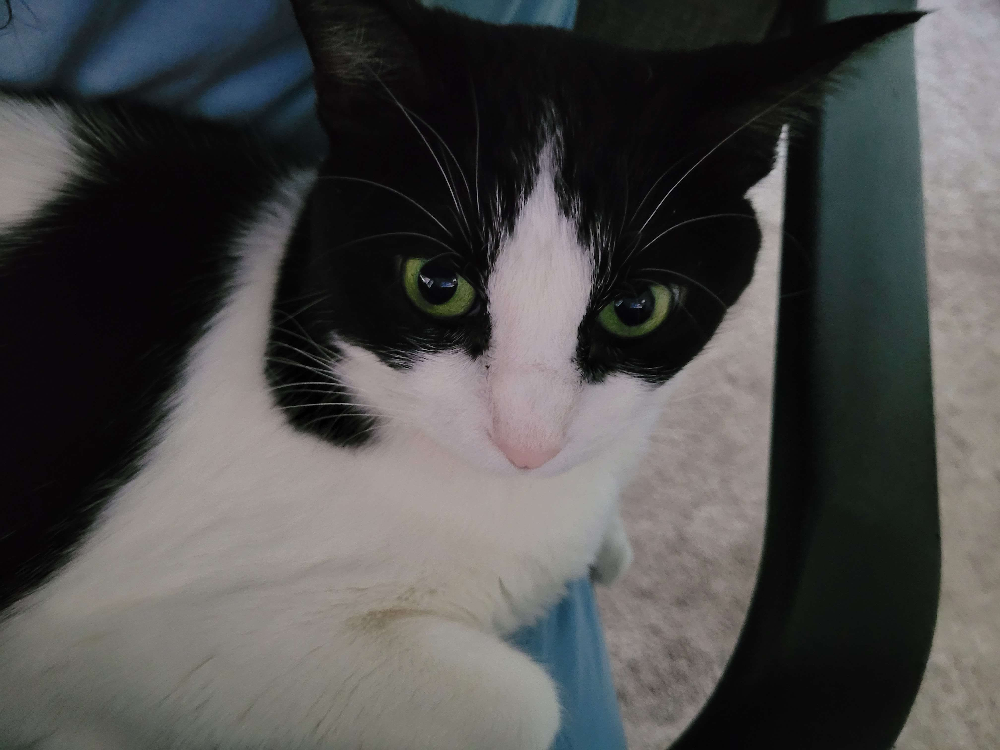

# Why cats are beautiful and good.

### Table of contents

- [positives of owning a cat](#positives-of-owning-a-cat)

## cats pee all over

##What is a Cat?
A cat also can be reffered as to a domestic cat or house cat is a carnivorous mammal long domesticated and kept as a pet or for catching rats and mice.

### Positives of owning a cat:

- cats are always there for you whenever you need someone to comfort you
- cats really fluffy
- cats are very food motivated
- i have too many cats
- wait i have 20 cats

### Negatives of owning a cat:

- litter box maintenance
- cat hair can everywhere
- cats can often be standoffish
- vet bills
- responsibilty - subjective

There are many cat breeds that are cute.

1. Turkish Angora

   

2. American Curl
3. Berman
4. Bengal
5. Kinten - 

[link to cat breeds](https://basepaws.com/cat-breeds)
